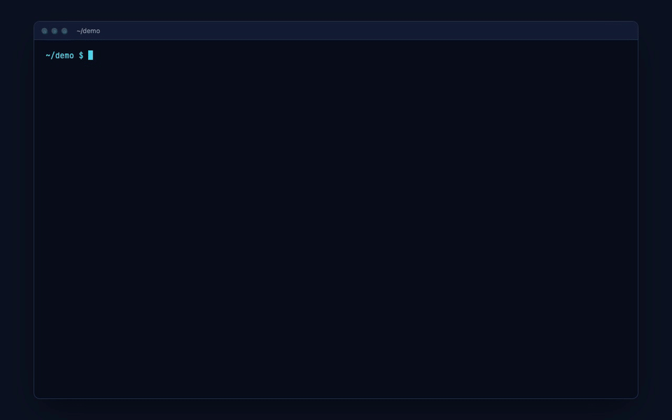

<p align="center">
  
</p>

Synapse turns a repository into a graph of its files and functions, ranks every file by
how much the rest of the code relies on it, and lets you explore the result in 3D or ask
questions whose answers cite their sources. It runs on your machine: parsing, ranking
and retrieval are local, and summaries and answers come from a local model unless you
choose the Anthropic API.



<sub>Recorded from a real run of the packaged CLI on pallets/flask. The terminal replays that
run's output with the 21 minutes of summarising sped up, and the model's 29-second wait
for the answer is shortened; the explorer is otherwise shown at real speed.</sub>

## Quick start

```bash
npx synapse-map serve https://github.com/pallets/flask
```

That clones the repository, analyses it, and opens the explorer in your browser. The
first run is the slow one: on Flask it took 21 minutes on an M2 Pro, nearly all of it
the local 14B model summarising the 50 most important files. `--summarize-top 10` cuts
that sharply, `--skip-summarize` removes it, and the result is cached in `.synapse/` in
the current directory, so the next `serve` is instant.

Once `serve` is running you can open more repositories from the page itself: paste a
GitHub URL or a local folder into the box on the start page, pick who summarises, and
the explorer opens on it when the analysis finishes. Repositories opened that way are
cached in `~/.synapse-map/repos/`, so reopening one is instant.

The same pipeline as separate steps, on a local project:

```bash
npx synapse-map analyze ~/code/your-project        # build the ranked graph
npx synapse-map index --path ~/code/your-project   # embed it for questions
npx synapse-map ask "where is authentication handled?" --path ~/code/your-project --show-sources
npx synapse-map serve ~/code/your-project          # explore it in 3D
```

`index` is optional: `ask` builds the index itself the first time. The command installs
as both `synapse-map` and `synapse`, so after `npm install -g synapse-map` either name
works.

## Requirements

- **Node.js 20 or later**, and **git** on your PATH for cloning and history. Node 20
  reached end of life in April 2026 and one transitive dependency now declares Node 22;
  it runs on 20, but 22 is the safer choice.
- **Ollama**, for summaries and questions. Pull the two default models once:

  ```bash
  ollama pull qwen2.5-coder:14b      # summaries and answers
  ollama pull nomic-embed-text       # embeddings for questions
  ```

  Any chat model you already have works instead: add `--model qwen2.5:14b-instruct`, for
  example. Without Ollama you still get the full graph and rankings: the analysis reports how to
  fix it and carries on without summaries, and the explorer disables only questions.
- **Or `GEMINI_API_KEY`**, to summarise, answer and embed with Gemini instead, with no
  Ollama needed at all; see [Providers](#providers).
- **Or `ANTHROPIC_API_KEY`**, to summarise and answer with Claude. Ollama is still
  needed for `index` and `ask`, because Anthropic has no embeddings endpoint.
- **A C++ toolchain only on uncommon platforms.** tree-sitter ships prebuilt binaries for
  macOS (arm64 and x64), Linux x64 and Windows x64. Anywhere else, such as Linux on ARM,
  npm compiles it on install, which needs Python, make and a C++ compiler.

## Commands

```
synapse analyze <path-or-github-url> [options]   Build the graph
synapse index [path] [options]                   Build/refresh the embedding index
synapse ask "<question>" [options]               Ask a question about the codebase
synapse serve [path-or-github-url] [options]     Serve the 3D UI and API

analyze:
  --out <dir>            Where to write graph.json (default: <target>/.synapse)
  --depth <n>            Clone depth when given a URL (default: 200)
  --token <token>        Credential for a private repository. Prefer the GITHUB_TOKEN
                         environment variable, which keeps it out of shell history.
  --top <n>              How many files to list in the summary (default: 10)
  --skip-churn           Skip the git history pass
  --skip-github          Skip fetching the repository's details from GitHub
  --skip-summarize       Skip LLM summarisation entirely
  --summarize-top <n>    How many top files to summarise (default: 50)
  --json                 Print the graph to stdout instead of writing a file

index:
  --path <dir>           Repo root, for recovering function signatures (default: .)

ask:
  --path <dir>           Repo root (default: .)
  --top-k <n>            How many chunks to retrieve (default: 8)
  --show-sources         List the files and functions the answer drew on
  --global-rank          Rank purely by similarity, without reserving seats per
                         chunk kind (file vs function). Off by default.

serve:
  --path <dir>           Repo root (default: .)
  --token <token>        Credential for a private repository, as for analyze
  --port <n>             Port to listen on (default: 4317)
  --host <addr>          Address to bind (default: 127.0.0.1)
  --no-open              Do not open a browser window
  --skip-summarize       Skip summarisation if a graph has to be built first
  --skip-github          Skip fetching the repository's details from GitHub

Shared:
  --out <dir>            Where .synapse artefacts live (default: <path>/.synapse)
  --provider <name>      ollama | anthropic  (default: ollama)
  --model <name>         Chat model (default: qwen2.5-coder:14b,
                         or claude-opus-5 with --provider anthropic)
  --embed-model <name>   Embedding model (default: nomic-embed-text)
  --ollama-url <url>     Ollama base URL (default: http://localhost:11434)
  -h, --help             Show this message
  -v, --version          Print the installed version
```

A local path is read in place and never modified. A URL is cloned shallowly into a
temporary directory, analysed, and removed; its artefacts land in `.synapse/` in the
directory you ran the command from.

For a repository on GitHub, whether a URL or a local folder whose `origin` points
there, the analysis also asks GitHub's API for its description, stars, forks, language,
topics, licence and default branch, alongside the parse so it adds no time. The explorer
and start page show them. It is decoration, never a requirement: offline, rate-limited
(60 requests an hour without a token) or private without a token, the analysis notes
why and carries on. A token given for a private clone also authenticates this one
request; `--skip-github` turns the lookup off.

## Providers

Three backends can write summaries and answer questions, chosen with `--provider` on
`analyze`, `ask` and `serve`, or with the Local / Gemini / Claude switch in the page:

| Provider | Chat model | Embeddings | Key |
| --- | --- | --- | --- |
| `ollama` (default) | `qwen2.5-coder:14b` | `nomic-embed-text`, local | none |
| `gemini` | `gemini-3.8-flash` | `gemini-embedding-001`, so no Ollama needed | `GEMINI_API_KEY` |
| `anthropic` | `claude-opus-5` | `nomic-embed-text` via Ollama | `ANTHROPIC_API_KEY` |

The default is `ollama`, and nothing leaves your machine on that path. With `gemini` or
`anthropic`, each prompt goes to that provider's API, and summarisation prompts include
up to the first 6,000 characters of each summarised file.

```bash
export GEMINI_API_KEY=...
npx synapse-map serve ~/code/your-project --provider gemini
```

Keys are read from the environment and nowhere else, never a flag, a file or the web
page, so they cannot land in shell history, a commit or a browser. In the page, a
provider whose key is not set, or a stopped Ollama, shows as disabled with the reason on
hover. An unset key fails up front with the command that fixes it.

All three receive byte-identical prompts: the summarisation prompt, its JSON schema and
the retrieval context are built by the same code, and tests assert it. Only the
transport differs.

**Embeddings follow the provider where they can.** Gemini has an embeddings endpoint, so
Gemini mode needs no Ollama at all. Anthropic has none, so `index` and `ask` keep
embedding with Ollama under `--provider anthropic`, and Synapse says so rather than
quietly swapping in another model. Each embedding model keeps its own index files, so
switching providers in the page reuses the index already built for each one instead of
re-embedding.

## Private repositories

`analyze` and `serve` clone private repositories with a token from the `GITHUB_TOKEN`
environment variable, or from `--token`. Prefer the variable: a flag lands in shell
history and in the process's own argument list. In the page, the start-page form has a
"Private repository?" field: its token goes to the local server once, is used for that
clone, and is never stored, logged or returned.

```bash
export GITHUB_TOKEN=ghp_...
npx synapse-map serve https://github.com/your-org/private-repo
```

The token reaches git through the child process's environment, read by an inline
credential helper, so it never appears in argv (where `ps` would show it to other users),
is never written to the clone's `.git/config`, and cannot be answered by your system
keychain instead. A credential pasted into the URL itself is stripped before the URL is
printed, returned by the server, or written to `graph.json`, and git's own error output
is scrubbed the same way. GitHub answers an unauthenticated request for a private
repository with "not found", the same as a typo, so a failed clone explains both
possibilities rather than guessing.

## The explorer

`serve` starts a local server and opens the explorer at `/graph`. It listens
immediately and, if the repository has no graph yet, analyses it in the background
while the page shows live progress, then swaps to the graph without a reload.

- **Nodes** are files, sized and coloured by importance, from dim cyan through green to
  amber. **Edges** are imports, drawn dim at the importer and bright at the file imported.
- **The slider** keeps the top percentage of files prominent. Larger repositories open on
  their most important few hundred files, and every file stays clickable.
- **Clicking a file** shows its summary, metrics (importance, imports each way, commits,
  lines) and top functions, with a button that pre-fills a question about it.
- **Ask** answers from the index and lists its sources; clicking a source flies the
  camera to that file. **Answer with** switches between Local, Gemini and Claude.
- **Labels** name the dozen most important files on the map, and the selected one.
  Labels that would overlap give way, files before folders.
- **View** switches between files and folders. Repositories over 400 files open in the
  folders view: each folder is one bubble, sized by its file count and coloured by its
  most important file, with lines for the imports between folders. Big folders split
  into their subfolders until there are about 40 bubbles; a folder with hundreds of
  subfolders, like `homeassistant/components`, keeps its largest few and groups the rest
  as one "+N more" bubble.
- **Clicking a folder** lists its most important files, with **Show its files** to open
  it in place and **Ask about this folder** to pre-fill a question. **Collapse all**
  closes every open folder. Opening a file from an answer's sources opens its folder.

`/` is the start page: paste a GitHub URL or a local folder there to analyse another
repository, or follow "Analyse another" from the explorer's toolbar.

The server binds to `127.0.0.1` by default and only answers requests addressed to
localhost, which stops a website you visit from reaching it through DNS rebinding. Every
response carries a strict Content-Security-Policy and no-framing headers. Binding to
another address with `--host` is an explicit choice to be reachable, and prints a warning:
the API has no authentication, and questions run the model, which costs money on a
cloud provider.

## Output

Everything is written to `.synapse/` beside the analysed project, or in the current
directory for a URL:

| File | What it holds |
| --- | --- |
| `graph.json` | The ranked graph: files, functions, imports, calls, metrics and summaries |
| `summaries.json` | Cached summaries, keyed by a hash of each file's path and contents |
| `embeddings.json`, `embeddings.bin` | The question index: chunk metadata and unit-length vectors |

A trimmed `graph.json`:

```jsonc
{
  "version": 2,
  "source": "https://github.com/owner/repo",
  "stats": { "fileCount": 12, "edgeCount": 28, "externalImports": 21, … },
  "repository": { "fullName": "owner/repo", "description": "…", "stars": 1200,
                  "language": "TypeScript", "license": "MIT", … },   // GitHub repos only
  "nodes": [
    {
      "id": "src/hub.ts",
      "path": "src/hub.ts",
      "language": "typescript",
      "importance": 0.85,
      "metrics": { "loc": 102, "churn": 3, "inDegree": 7, "outDegree": 0,
                   "centrality": 1, "churnScore": 0.5 },
      "summary": "Defines the shared helpers the rest of the package builds on.",
      "functions": [ "src/hub.ts#sharedHelper" ]   // ids into functionNodes
    }
  ],
  "edges": [ { "from": "src/app.ts", "to": "src/hub.ts", "type": "import", "weight": 1 } ],
  "functionNodes": [ { "id": "src/hub.ts#sharedHelper", "name": "sharedHelper",
                       "kind": "function", "startLine": 1, "importance": 1,
                       "summary": "Doubles the value it is given." } ],
  "functionEdges": [ { "from": "src/util.ts#double", "to": "src/hub.ts#sharedHelper",
                       "type": "call", "weight": 1 } ],
  "summarization": { "ran": true, "model": "qwen2.5-coder:14b", "selected": 50,
                     "fromCache": 47, "generated": 3, "failed": 0 }
}
```

`functionNodes` is the single source of truth for declarations; `nodes[].functions`
holds ids into it.

## How it works

**Ingestion.** Walks the tree honouring `.gitignore` at every level, including nested
ignore files and negation patterns. `node_modules`, `.git`, virtualenvs and build output
are always skipped.

**Parsing.** tree-sitter parses JavaScript, TypeScript, TSX and Python, extracting
imports (ESM, `require`, dynamic `import()`, Python's `import` and `from … import`
including relative forms), function, class and method declarations, and call sites
attributed to their enclosing function. Source is fed through tree-sitter's callback
input, which has no size limit; handing the Node binding a string silently fails above
32KB, which once dropped the largest and most-depended-on files from the graph. A file
that cannot be parsed is recorded in `parseFailures` and reported, never dropped quietly.

**Resolution.** Imports are matched only against files that exist: TypeScript's NodeNext
`./foo.js` meaning `./foo.ts`, directory imports resolving to `index.*`, Python relative
imports with several leading dots, absolute imports under a `src/` layout, and bare
specifiers naming sibling workspace packages. Anything left is counted as external,
never invented as a node.

**Scoring.** Two signals, blended 70/30. *Centrality* is PageRank over the import graph,
edges pointing from importer to imported, so importance flows to what everything depends
on. *Churn* counts the commits touching each file with `git log --follow`, so a renamed
file keeps its history; counts are log-compressed, so one 400-commit config file cannot
flatten everything else. Without git history, centrality takes the full weight.
Functions are ranked the same way over the call graph.

**Summarisation.** The top `--summarize-top` files get a 1-3 sentence summary, plus one
sentence for each file's three most-called functions, from one structured-output request
per file. The prompt carries the file's path, the metrics that made it significant, its
real declaration signatures and the first 6,000 characters of source. Function names the
file does not declare are dropped, so a hallucinated name cannot reach the graph. Results
are cached by content hash and model, so a re-run only pays for files that changed.

**Retrieval.** `ask` embeds the question locally, retrieves the closest chunks, and has
the model answer only from them, saying so when they fall short. There are two chunk
granularities: one per file (summary, declarations, metrics) for "where does X live",
and one per summarised function (summary, real signature, calls) for specific
behaviour. Half the results are reserved for each kind, because the broader file chunks
otherwise crowd out the function chunk holding the answer; `--global-rank` turns that
off. Chunks are keyed by a hash of their text, so re-indexing embeds only what changed.

**Vector store.** Brute-force cosine similarity over a flat `Float32Array` of unit-length
vectors, deliberately. Even a large repository lands in the low tens of thousands of
chunks, where a query takes 3ms at 1,000 chunks, 6ms at 5,000, 24ms at 20,000 and 60ms at
50,000. An embedded vector database would have pulled in 134 packages, including other
vendors' SDKs, for no gain at this size. The store sits behind a `VectorStore`
interface, so swapping in an approximate index later is a contained change.

**Rendering.** The whole graph is two draw calls, one instanced mesh for the nodes and one
line buffer for the edges, whatever its size. The force layout runs to completion in a
Web Worker before the first frame, so the page stays responsive and shows progress while
a large graph settles. The camera frames the important files rather than the whole
cloud: it orbits their importance-weighted centre and frames the 90th percentile of their
spread. The layout centres the mass of *all* files, which in a real repository is mostly
tests, examples and docs, so framing the cloud put the core off to one side at a fraction
of the screen. Node sizes scale with that frame, so a node looks the same size on a
20-file repository and an 18,000-file one, and the view is offset to sit beside the
panels rather than behind them.

## Known limits

- **Large repositories work, slowly.** On home-assistant/core (18,932 files, 118MB of
  source) parsing takes about 42 seconds and peaks around 1.1GB of memory, churn adds
  about 2.5 minutes, the explorer's layout about 40 seconds, and building the question
  index about 10 minutes.
- **Churn is one git process per file.** `git log --follow` accepts a single path, so the
  history pass runs one process per file, 16 at a time. It is the slowest analysis step
  on large repositories; `--skip-churn` drops it and ranks on centrality alone.
- **The vector store is brute force.** Query time grows linearly: 60ms at 50,000 chunks is
  fine, but a monorepo far beyond that would want an approximate index.
- **Very large graphs are dense at the core.** On home-assistant/core the folders view
  gives about 65 bubbles, but folders sit where the layout put their files, so the core's
  folders overlap, and the two "+N more" bubbles hold most of the files. Opening a folder,
  the files view's slider, and following the sources of an answer are the useful ways in.
- **Call resolution is by name, not scope.** Two same-named functions in one file collapse
  into the first, and dynamic dispatch and re-exported names are not traced.
- **Only JavaScript, TypeScript, TSX and Python are parsed.** Other files are ignored.
- **Summaries describe the head of a file.** The prompt includes the first 6,000
  characters, so a summary of a very large file describes its beginning, and summaries
  are only as good as the model writing them.
- **Questions search summaries and declarations, not raw source.** An answer that lives in
  an unsummarised function body will not be found, whatever the ranking. Raising
  `--summarize-top` widens what is answerable.
- **Repositories analysed from a URL lose their source afterwards.** The clone is deleted
  once the graph is built, so the question index falls back to the signatures stored in
  the graph instead of reading them from source. Clone the repository and analyse the
  local path when question quality matters.
- **Embeddings need an embedding model.** A chat model cannot embed; `index` detects the
  mistake and names the fix.
- **`--provider anthropic` sends code to Anthropic.** Local remains the default for exactly
  that reason.

## Development

Synapse is an npm-workspaces monorepo built with Turborepo:

| Package | What it is |
| --- | --- |
| `packages/core` | The analysis engine: ingestion, parsing, graph, scoring, providers, retrieval |
| `packages/server` | The Fastify API over core, and the security headers and host guard |
| `packages/cli` | The `synapse` command |
| `packages/web` | The React and react-three-fiber explorer and overview page |

```bash
npm install
npm run build          # every package in dependency order, cached by Turborepo
npm test               # the core test suite
node packages/cli/dist/src/index.js serve .
```

The tests build real git repositories in temporary directories and run the actual walker,
parser and `git log` against them, with no mocks for any of that. Summarisation and
retrieval run against a fake model backend and a deterministic bag-of-words embedder, so
the suite never starts a model or touches the network.

To work on the UI, run the API and the Vite dev server side by side; Vite proxies `/api`:

```bash
node packages/cli/dist/src/index.js serve . --no-open   # API on :4317
npm run dev --workspace @synapse/web                    # UI on :5317
```

The overview page's live graph renders `packages/web/src/landing/sample-graph.json`, a
trimmed analysis of this repository; regenerate it with
`npm run sample-graph --workspace @synapse/web -- <path/to/graph.json>`. The GitHub URL
the pages link to lives in `packages/web/src/site.ts`. Before hosting the overview on a
domain, add a canonical link, `og:url`, `og:image` and a sitemap, which all need the
absolute URL.

### Packaging

```bash
npm run release:pack
```

This builds everything and assembles the publishable `synapse-map` package in
`release/`: the compiled CLI, core and server with their internal imports made relative,
the built web app, and `THIRD_PARTY_NOTICES.md` for everything bundled into it. The
internal `@synapse/*` names are never published. The script refuses to pack if any
shipped import is not a declared dependency, and it only packs; publishing is a separate,
deliberate step.

## License

MIT, see [LICENSE](LICENSE). The package also ships `THIRD_PARTY_NOTICES.md` for the
libraries and fonts bundled into the web app.
